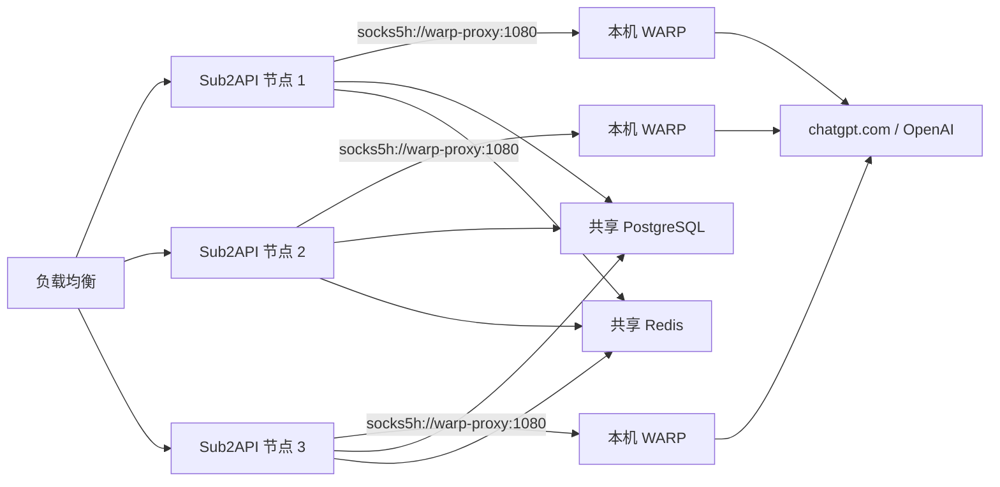

# OpenAI/Codex WARP 出口设计

## 目标

为三台 Docker Compose 部署的 Sub2API 节点各自提供一个本地 Cloudflare WARP SOCKS5 出口。未绑定账号代理的 OpenAI/ChatGPT/Codex 请求默认通过本节点 WARP 出站；已绑定账号代理的请求继续优先使用账号代理。管理员可以在共享后台动态启停默认代理，并选择代理不可用时禁止直连或允许直连。

该设计只改变 OpenAI 平台的上游出站选择，不修改宿主机或应用容器的默认路由，也不代理 PostgreSQL、Redis、Claude、Gemini、Grok、对象存储和版本更新流量。

## 部署拓扑

每台应用机器运行相同的 Compose 服务：

- `sub2api`：应用容器。
- `warp-proxy`：本节点 WARP SOCKS5 sidecar，容器内监听 `1080`。

应用使用统一地址 `socks5h://warp-proxy:1080`。该名称由每台机器自己的 Compose 网络解析，因此三台机器使用同一份数据库配置但分别连接本机 sidecar。`warp-proxy` 不发布宿主机端口，只允许同一 Compose 网络中的容器访问。

Sub2API 已原生支持 `socks5h`、代理端 DNS 解析、OpenAI HTTP/2、TLS 指纹和 WebSocket 代理，不需要 Privoxy 做协议转换。当前没有 Cloudflare 浏览器挑战，因此不部署 FlareSolverr。



## 运行时设置

后台系统设置新增一个 OpenAI 默认代理配置对象：

- `enabled`：是否为未绑定账号代理的 OpenAI 请求启用节点默认代理。
- `proxy_url`：默认 `socks5h://warp-proxy:1080`，只接受 `http`、`https`、`socks5`、`socks5h`，保存前使用现有 `proxyurl.Parse` 校验和规范化。
- `failure_policy`：`fail_closed` 或 `fallback_direct`。

默认值为：

```text
enabled = true
proxy_url = socks5h://warp-proxy:1080
failure_policy = fail_closed
```

`fail_closed` 表示所有代理候选均失败后返回可诊断的上游代理错误，绝不静默直连。`fallback_direct` 表示所有代理候选均因连接、DNS、代理握手或 TLS 等传输错误失败后，允许进行一次直连重试。上游返回 HTTP 状态码不触发直连重试，避免把鉴权、限流或业务错误误判成代理故障。

设置保存在共享 PostgreSQL。保存成功后发布 Redis Pub/Sub 失效通知，使三台实例立即刷新各自的只读运行时快照；同时保留短 TTL 的数据库刷新作为 Pub/Sub 丢失或重连期间的最终一致性兜底。请求热路径只读取原子快照，不逐请求查询 PostgreSQL 或 Redis。

当数据库或 Redis 临时不可用时，实例继续使用最近一次有效快照。进程首次启动且无法读取设置时使用安全默认值 `enabled=true`、`proxy_url=socks5h://warp-proxy:1080`、`failure_policy=fail_closed`，不能因设置读取失败退化为直连。

## 代理选择与故障顺序

每个 OpenAI 请求在首次出站前生成一次不可变候选列表，同一请求的重试和协议降级复用该列表：

1. 账号已绑定且可用的主代理。
2. 主代理配置的可用备用代理链，跳过已过期、停用、缺失或成环成员。
3. 全局默认代理，即本节点 `socks5h://warp-proxy:1080`。
4. 仅当 `failure_policy=fallback_direct` 时追加直连候选。

候选 URL 去重，避免账号代理恰好等于全局默认代理时重复发送。账号未绑定代理时从第 3 步开始。全局默认代理关闭时保持现有行为：账号代理继续生效；无账号代理则直连。代理配置无效时保存设置直接失败，不允许运行时把无效 URL 当成直连。

账号代理的现有到期持久化切换逻辑继续保留。请求内的候选切换只影响当前请求，不改写账号的 `proxy_id`，避免瞬时网络抖动造成三台实例竞争更新数据库。

## 请求覆盖范围

所有访问 OpenAI、`chatgpt.com` 或 OpenAI 兼容账号的出站路径必须使用同一个代理策略解析器，至少包括：

- Responses、Chat Completions、Messages bridge、透传和协议转换请求。
- OpenAI Responses WebSocket、HTTP bridge 和 Live 会话握手。
- 图片、Embedding、Count Tokens、Alpha Search、Compact 和模型列表探测。
- OpenAI/Codex 账号连接测试、配额与订阅查询、上游计费探测。
- OpenAI OAuth/PAT Token 刷新及身份恢复所需请求。

仅依赖 `account.Proxy.URL()` 的分散判断应收口到统一解析器。HTTP 请求继续通过 `HTTPUpstreamProfileOpenAI` 标记流量；WebSocket 路径使用相同的候选快照和错误分类，不能因绕过通用 `HTTPUpstream` 而直连。

Grok 虽由部分 OpenAI gateway 文件承载，但平台不是 OpenAI，不应用本默认 WARP。OpenAI 兼容 API Key 账号仍属于 OpenAI 平台并使用此策略；其自定义 `base_url` 不改变代理选择。

## 重试约束

- 只有未收到 HTTP 响应的传输错误才能切换到下一个代理候选。
- 请求体必须可重放；无法重放的请求在第一次发送前即拒绝配置多候选重试，不能发送半个请求后猜测重试。
- 每个候选最多尝试一次，继续沿用现有请求总超时和账号并发槽位，不为每个候选重新获得完整超时预算。
- 流式请求一旦收到响应头或向客户端写出数据，不再切换出口。
- WebSocket 只在握手完成前切换候选；会话建立后断线沿用现有 WS 重连和 HTTP bridge 策略。
- 代理失败日志必须脱敏，不输出代理用户名、密码或完整 URL。

## Compose 与启动行为

新增独立的 WARP Compose overlay，避免把高权限 sidecar 强制加入普通部署：

```text
docker compose -f docker-compose.standalone.yml -f docker-compose.warp.yml up -d
```

`warp-proxy` 需要：

- `/dev/net/tun`。
- `NET_ADMIN`；只有镜像实际要求时才保留 `SYS_MODULE`。
- WARP 所需的 IPv4/IPv6 sysctl。

镜像必须固定版本或 digest，不使用不可复现的 `latest`。Sub2API 容器保持 `no-new-privileges`，高权限只授予 WARP sidecar。

Compose 健康检查分两层：SOCKS5 端口可连接，以及通过 SOCKS5 访问外部探测端点并确认获得有效出口。Sub2API 本身始终可以启动并提供管理端和其他平台服务；WARP 不健康时 OpenAI 行为由 `failure_policy` 决定。应用启动日志记录当前代理策略、脱敏地址和本节点代理健康状态。

## 管理端与可观测性

系统设置中的 OpenAI 区域增加：

- “节点默认代理”开关。
- 代理 URL 输入框。
- “代理不可用时”选项：`禁止直连` / `允许直连`。
- 当前实例的代理连通状态、出口 IP、最近检查时间和脱敏错误。

由于三台节点出口不同，单一后台请求只能直接展示当前处理该请求的节点状态。完整节点列表需要实例注册或集中指标系统，不在第一版新增。第一版必须在状态响应中包含实例标识，便于从负载均衡逐节点检查。

指标至少包括：

- 按来源统计的请求数：账号代理、备用代理、节点 WARP、直连。
- 代理候选切换次数和原因。
- `fail_closed` 拒绝次数与 `fallback_direct` 直连次数。
- WARP 健康状态、探测延迟和出口 IP 变化。
- HTTP 与 WebSocket 的代理握手失败数。

所有 `fallback_direct` 事件使用 warning 日志并带请求 ID、账号 ID、实例 ID 和失败阶段，明确指出发生了出口降级。

## 安全边界

- WARP 和 SOCKS5 端口不映射到公网或宿主机全网卡。
- 后台代理设置仅管理员可读写，修改进入现有管理员审计日志。
- API 返回和日志中的代理 URL 必须使用 `url.URL.Redacted()` 或等价脱敏。
- 不关闭上游 TLS 证书校验。
- 不向 WARP 容器挂载数据库凭据、Redis 凭据或应用数据卷。
- 上线前检查 `caomingjun/warp` 镜像来源、Dockerfile 和发布 digest；无法接受其高权限风险时，用受控自建 WARP 镜像或外部 SOCKS5 服务替换，Sub2API 配置无需变化。

## 验证标准

- 三台节点使用相同 `socks5h://warp-proxy:1080` 设置时，分别通过本机 WARP 出口访问 OpenAI。
- 未绑定代理的 OpenAI HTTP、HTTP/2 和 WebSocket 请求不会直连。
- 已绑定账号代理的请求优先走账号代理；传输故障时按备用代理、本机 WARP 顺序切换，且只有 `failure_policy=fallback_direct` 时才允许最后直连。
- Claude、Gemini、Grok、数据库、Redis 和更新请求不受该设置影响。
- 后台切换 `fail_closed` / `fallback_direct` 后三台实例在失效通知传播窗口内一致生效。
- Redis Pub/Sub 中断后，实例可通过 TTL 刷新收敛到 PostgreSQL 中的最新配置。
- 非法代理 URL、WARP 未启动、SOCKS5 拒绝连接、DNS 失败、TLS 失败和 WebSocket 握手失败均有覆盖测试。
- `fail_closed` 下抓包或测试代理确认不存在 OpenAI 直连；`fallback_direct` 下只在所有代理候选发生传输错误后产生一次直连。
- WARP sidecar 重启不会导致 Sub2API 管理端或其他平台网关退出。

## 发布顺序

1. 先在单节点验证宿主机 TUN 和 capability，固定可用 WARP 镜像 digest。
2. 上线代码和管理端设置，但保持 `enabled=false`，验证跨实例配置传播。
3. 三台节点部署 WARP overlay，逐节点验证 SOCKS5 出口和 OpenAI HTTP/WebSocket。
4. 开启默认代理并选择 `fail_closed`，观察代理握手、断流和延迟指标。
5. 仅在业务明确接受真实 IP 暴露风险时切换为 `fallback_direct`。

## 非目标

- 不修改整机或 Sub2API 容器的默认路由。
- 不提供 IP 轮换池、账号节点亲和或固定出口保证。
- 不自动获取或注入 Cloudflare `cf_clearance`。
- 不部署 FlareSolverr。
- 不在第一版提供中央 WARP 高可用集群或跨节点代理负载均衡。
